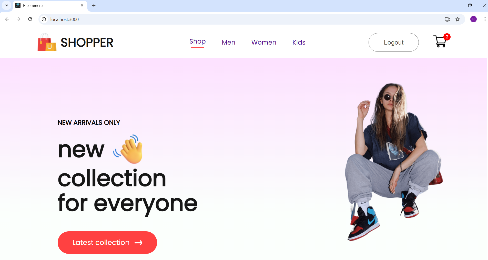
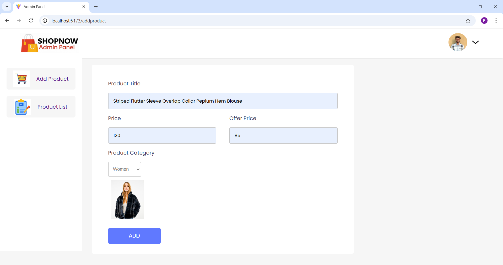
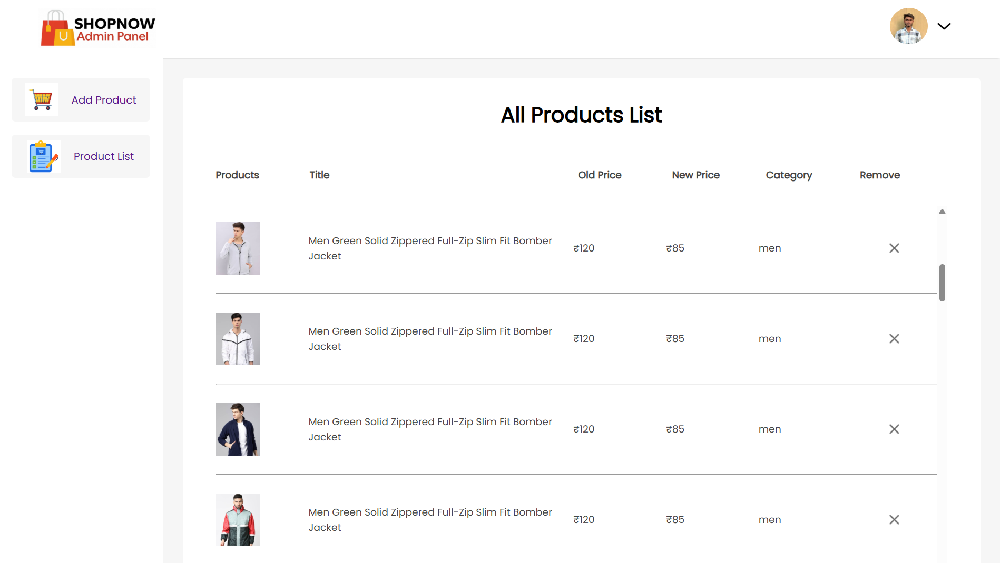
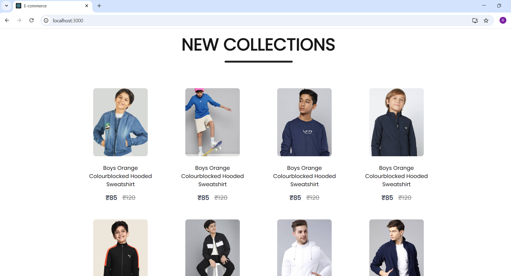
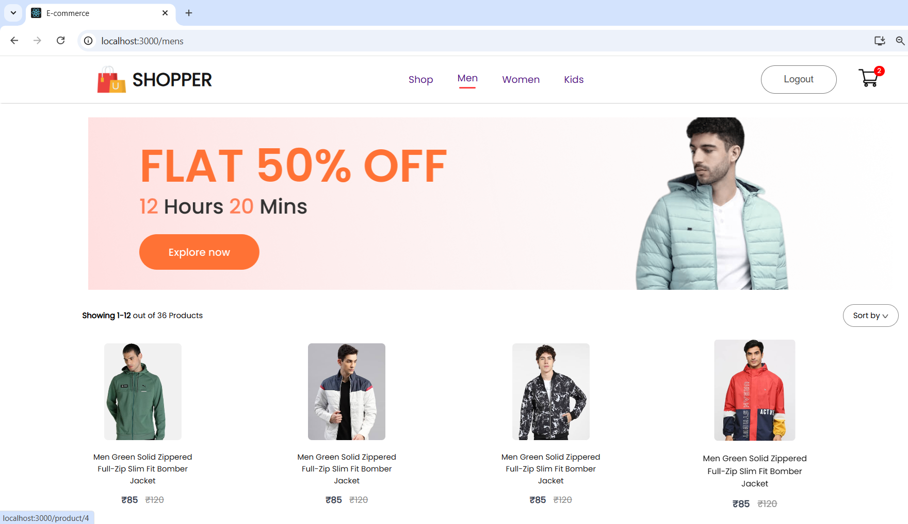
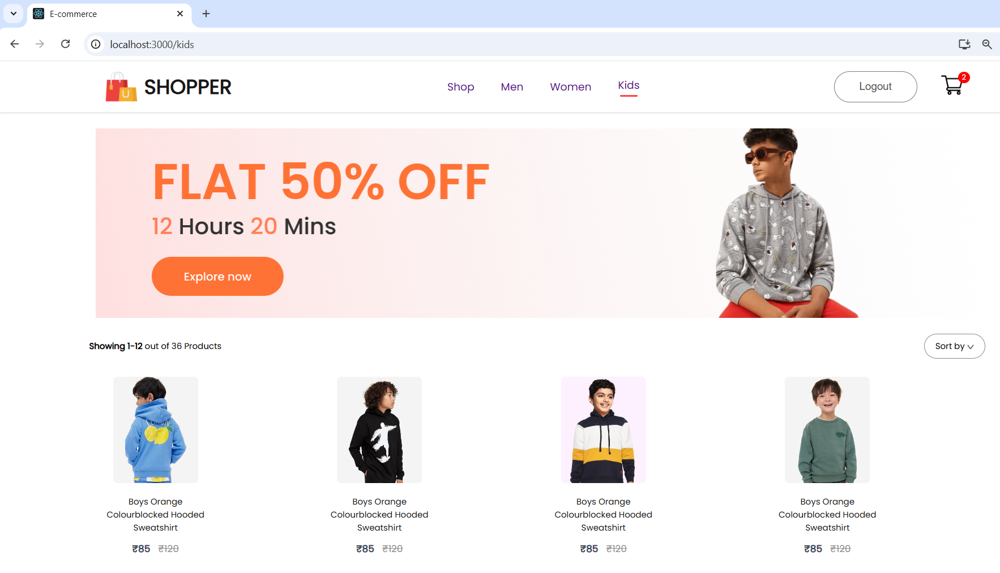
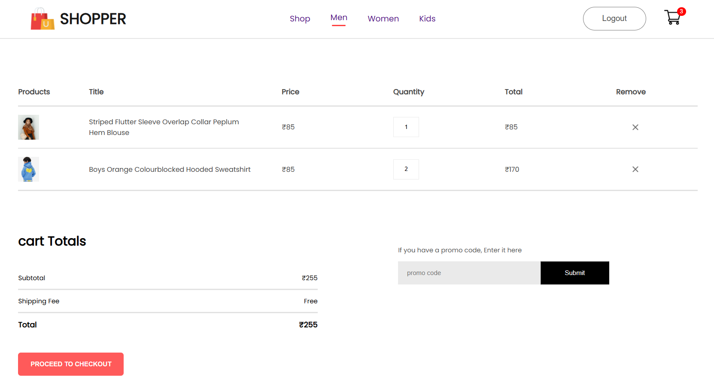
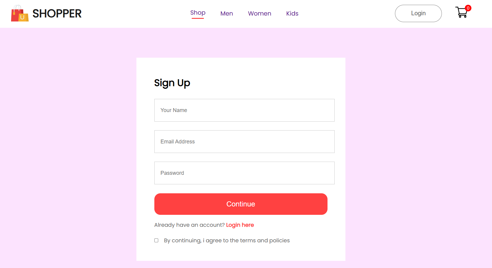
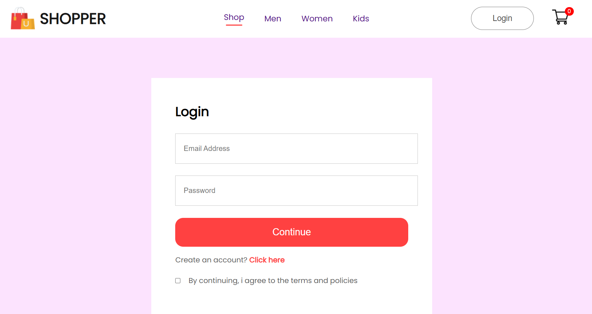

🛒 ShopNow – Full Stack E-Commerce Website

ShopNow is a full-stack E-Commerce application built using React, Node.js, Express, and MongoDB, featuring an Admin Panel, User Frontend, and a secure JWT-based Authentication System.
Users can browse products, view product details, manage their cart, and securely checkout.
Admins can add/remove products through a dedicated dashboard.

🚀 Features
⭐ User Frontend

🛍 Browse products

🔎 View product details (images, description, price, category)

🛒 Add to cart / remove from cart

❤️ Products categories (Men, Women, Kids)

🔥 New Collections section

🌟 Popular in Women section

🔐 Login / Signup with JWT

🔁 Cart items persist after login

📱 Fully responsive UI

⭐ Admin Dashboard

➕ Add products (name, price, image, category)

🗑 Remove products

📦 View product list

📤 Upload product images using Multer

⭐ Backend API

Secure JWT authentication

MongoDB product management

User cart management

Token-protected routes

Persistent cart stored in MongoDB

🧰 Tech Stack
Frontend (User)

React.js

React Router

Context API (Global state management)

CSS

Admin Panel

React + Vite

Multer (Image uploads)

Backend

Node.js

Express.js

MongoDB + Mongoose

JWT Authentication

Multer (image uploads)

CORS enabled

📁 Folder Structure
ShopNow/
│── backend/
│   ├── index.js          # Main server file
│   ├── routes/           # API routes
│   ├── models/           # MongoDB models
│   ├── upload/images/    # Uploaded product images
│
│── frontend/
│   ├── src/
│   ├── public/
│   ├── package.json
│
│── admin/
│   ├── src/
│   ├── public/
│   ├── package.json
│
└── README.md

⚙️ Environment Setup
🖥 Backend
cd backend
npm install
node index.js

Server starts at:

http://localhost:4000

🎨 Frontend
cd frontend
npm install
npm start

Runs at:

http://localhost:3000

🛠 Admin Panel
cd admin
npm install
npm run dev

Runs at:

http://localhost:5173

🔑 Authentication

Your app uses JWT tokens:

Token created on signup/login

Sent in header as auth-token

Used to validate protected routes:

/addtocart

/removefromcart

/getcart

📡 API Endpoints
Product APIs
Method	Endpoint	Description
GET	/allproducts	Get all products
GET	/newcollections	Get last 8 products
GET	/popularinwomen	Get 4 women category products
POST	/addproduct	Add product (Admin)
POST	/removeproduct	Delete product (Admin)
User Auth APIs
Method	Endpoint	Description
POST	/signup	Register a new user
POST	/login	Login user and return JWT
Cart APIs
Method	Endpoint	Protected	Description
POST	/addtocart	Yes	Add item to cart
POST	/removefromcart	Yes	Remove item from cart
POST	/getcart	Yes	Load cart from DB

## 🖼 Screenshots

### 📌 Home Page

### 📌 Product Listing Page

### 📌 Product Details Page

### 📌 Cart Page

### 📌 Login Page

### 📌 Signup Page

### 📌 Admin Dashboard

### 📌 Add Product Page (Admin)

### 📌 Product List (Admin)

### 📌 Mobile View

🙌 Contributing

Pull requests are welcome!
For major changes, please open an issue to discuss what you'd like to change.

📜 License

This project is licensed under the MIT License.
